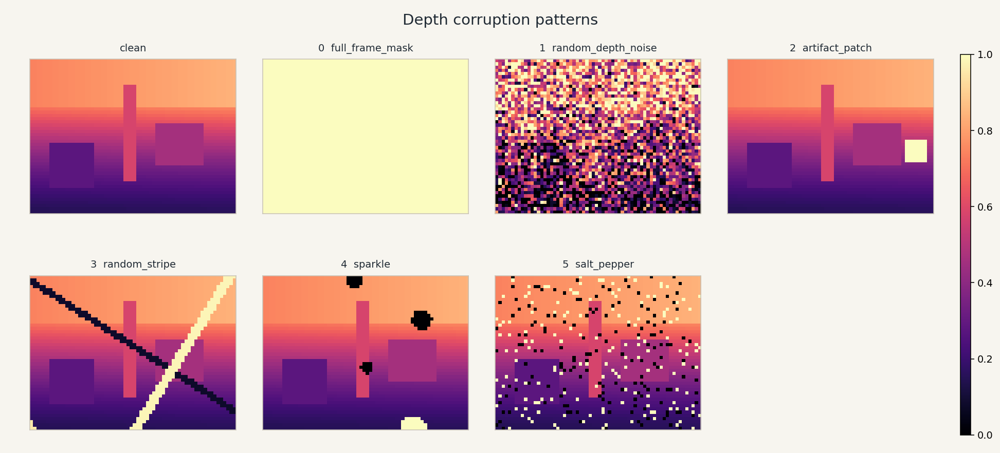
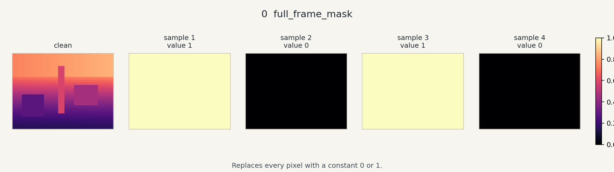
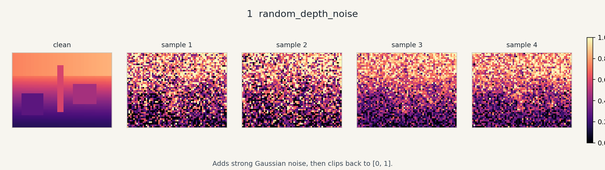
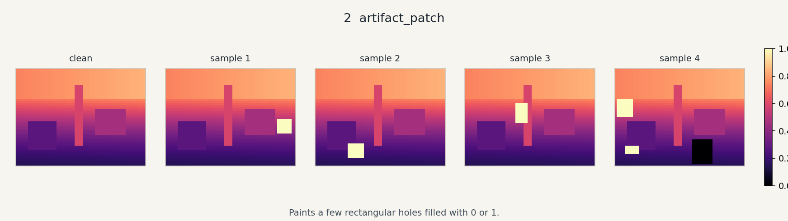
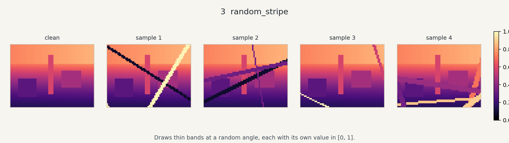
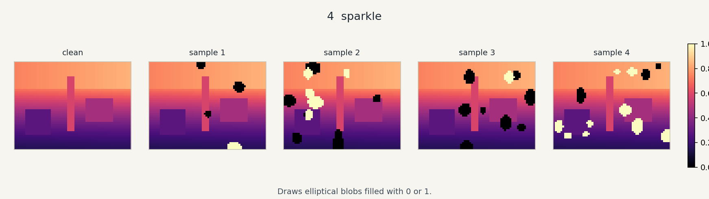
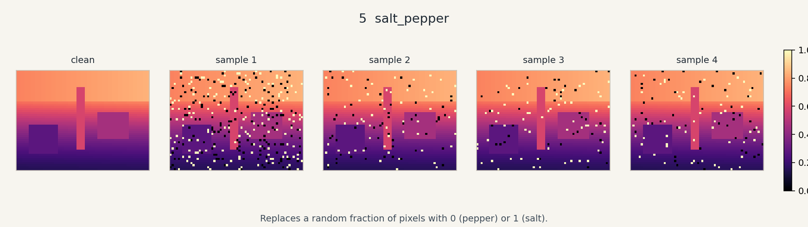

# Depth Corruption

Visual patterns painted onto already-normalized depth images `(N, H, W, C)`
during corruption bursts. Burst timing lives in `DepthCorruptionNoiseModel`.
This package only paints the image.

Mode index matches `DEPTH_CORRUPTION_MODE_NAMES`:

0. `full_frame_mask`
1. `random_depth_noise`
2. `artifact_patch`
3. `random_stripe`
4. `sparkle`
5. `salt_pepper`

## Preview

Preview captions and the synthetic image size live in
`preview/preview_depth_corruption_cfg.py`. Pattern parameters come from
`DepthCorruptionPatternCfg`, so the pictures match the code defaults.

```bash
cd <path-to-LocoLab>/source/locolab/locolab/utils/noise/corruption/preview
python preview_depth_corruption.py
```

The script needs `torch`, `numpy`, and `matplotlib`. Isaac Sim is not required.

By default it writes one PNG strip per pattern to `preview/pattern_previews/`,
an `overview.png`, an `index.html` gallery, and refreshes the generated section
below. Each strip shows the same synthetic depth image (`clean`) and several
independent samples. Color is only a display scale for normalized depth in
`[0, 1]`.

Open `preview/pattern_previews/index.html` in a browser for the full gallery.

## Preview Gallery

<!-- BEGIN_AUTO_PREVIEWS -->

This section is generated by `preview/preview_depth_corruption.py`.



| Pattern | What it does | Preview |
| --- | --- | --- |
| `full_frame_mask` | Replaces every pixel with a constant 0 or 1. |  |
| `random_depth_noise` | Adds strong Gaussian noise, then clips back to [0, 1]. |  |
| `artifact_patch` | Paints a few rectangular holes filled with 0 or 1. |  |
| `random_stripe` | Draws thin bands at a random angle, each with its own value in [0, 1]. |  |
| `sparkle` | Draws elliptical blobs filled with 0 or 1. |  |
| `salt_pepper` | Replaces a random fraction of pixels with 0 (pepper) or 1 (salt). |  |

<!-- END_AUTO_PREVIEWS -->
