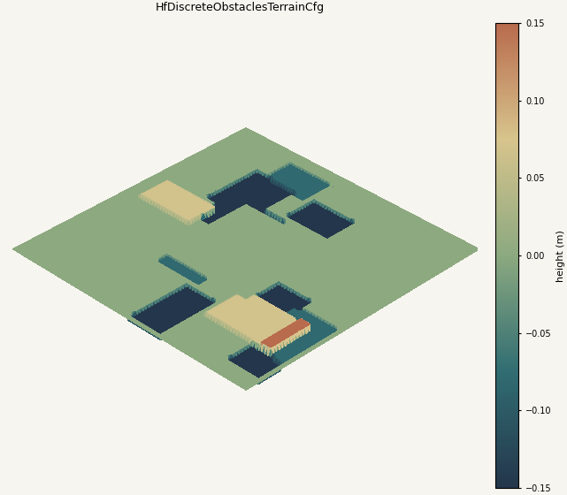
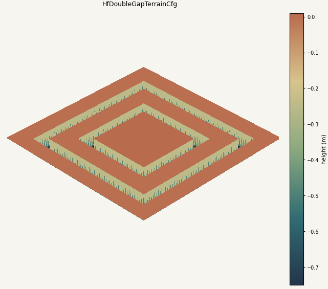
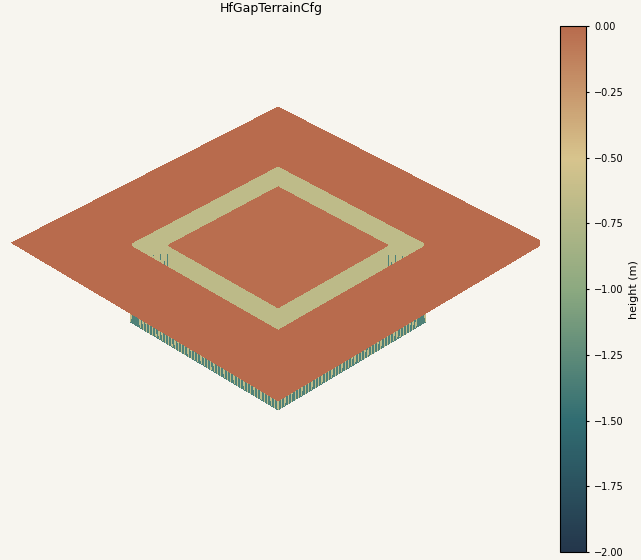
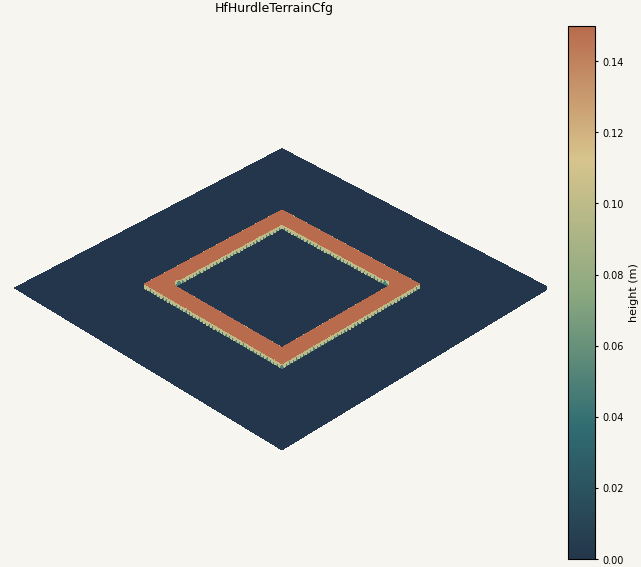
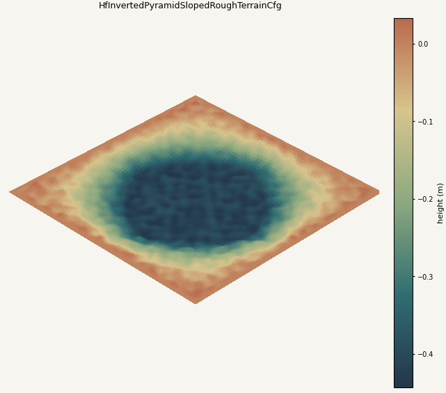
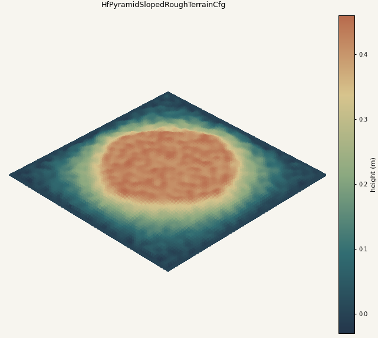
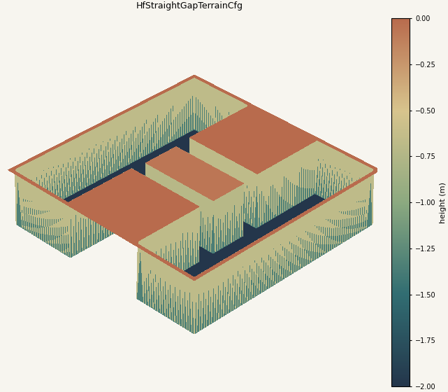
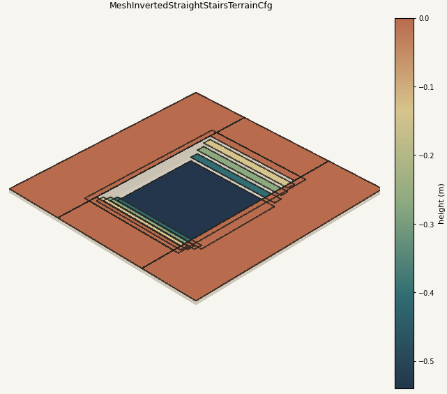
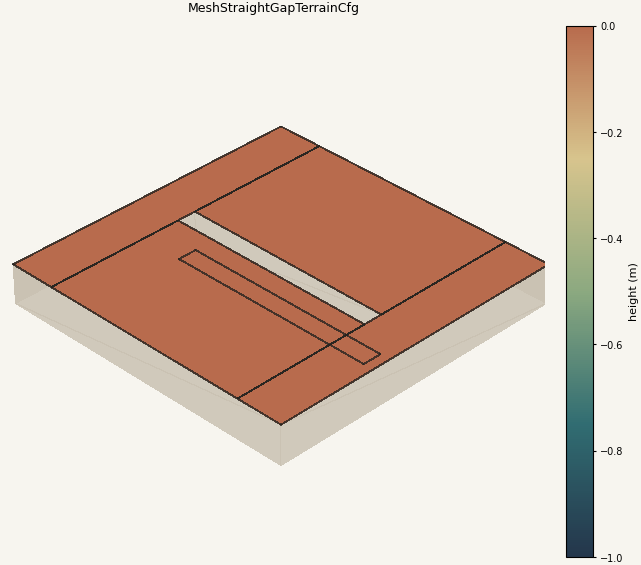
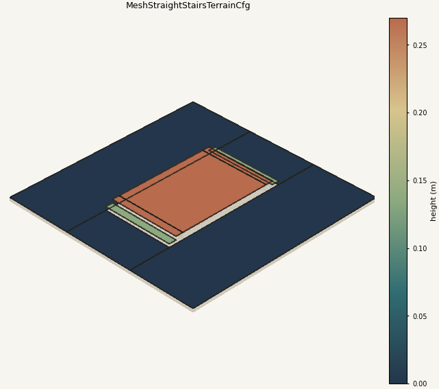

# LocoLab Terrains

Custom IsaacLab terrain generators used by LocoLab.  The package is split by
terrain representation:

- `locolab_hf_terrains.py`: height-field terrain functions.
- `locolab_hf_terrains_cfg.py`: height-field terrain config classes.
- `locolab_mesh_terrains.py`: direct `trimesh` terrain functions.
- `locolab_mesh_terrains_cfg.py`: mesh terrain config classes.

`__init__.py` exports concrete `*TerrainCfg` classes for use by training terrain
configs.

## Preview

Preview configs are separate from training configs and live in
`preview/preview_locolab_terrains_cfg.py`.

```bash
cd <path-to-LocoLab>/LocoLab/source/locolab/locolab/utils/terrains/locolab_terrains/preview
python preview_locolab_terrains.py
```

By default, the script writes one PNG per terrain to
`preview/terrain_previews/`, overwrites existing preview images with the same
names, writes an `index.html` gallery, and updates the generated preview table
below.

Mesh terrains default to a clean top view.  To overwrite the default preview
images with 3D mesh previews:

```bash
python preview_locolab_terrains.py --mesh-view 3d
```

## Adding Terrain

1. Add the terrain generation function to `locolab_hf_terrains.py` or
   `locolab_mesh_terrains.py`.
2. Add the matching `*TerrainCfg` class to the corresponding `*_cfg.py` file.
3. Export the cfg class from `__init__.py`.
4. Add representative preview parameters to
   `preview/preview_locolab_terrains_cfg.py`.
5. Run `python preview_locolab_terrains.py` and check the generated image.

## Existing Terrain Previews

<!-- BEGIN_AUTO_PREVIEWS -->

This section is generated by `preview/preview_locolab_terrains.py`.

| Terrain | Preview |
| --- | --- |
| `HfDiscreteObstaclesTerrainCfg` |  |
| `HfDoubleGapTerrainCfg` |  |
| `HfGapTerrainCfg` |  |
| `HfHurdleTerrainCfg` |  |
| `HfInvertedPyramidSlopedRoughTerrainCfg` |  |
| `HfPyramidSlopedRoughTerrainCfg` |  |
| `HfStraightGapTerrainCfg` |  |
| `MeshInvertedStraightStairsTerrainCfg` |  |
| `MeshStraightGapTerrainCfg` |  |
| `MeshStraightStairsTerrainCfg` |  |

<!-- END_AUTO_PREVIEWS -->
